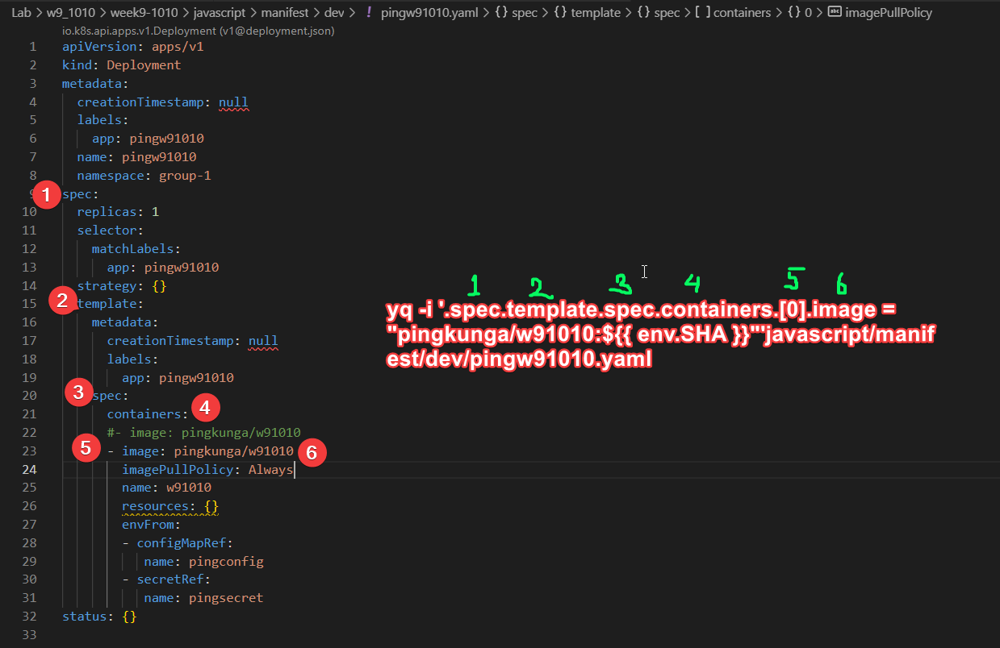

# Note

## App & Deployment

* แก้ App Server.js เพื่อเตรียมให้่มันอ่าน ConfigMap และ Secret ได้

```javascript
// message ตัวแปรที่อ่านจาก ConfigMap
app.get("/pmessage", (req, res) => {
  res.json({ message: `${process.env.message}` });
});

// secretmessage ตัวแปรที่อ่านจาก Secret
app.get("/psecretmessage", (req, res) => {
  res.json({ message: `${process.env.secretmessage}` });
});
```

* Deployment File / Service File / ConfigMap File / Secret File

```bash
- ใช้ Command 

```bash
#สร้าง Deployment และ Service ของ w91010
kubectl create deployment pingw91010 --image=pingkunga/w91010 -n group-1 --dry-run=client -o yaml > pingw91010.yaml
kubectl expose deployment pingw91010 --name=pingw91010-svc --port=80 --target-port=3000 -n group-1 -o yaml --dry-run=client -o yaml > pingw91010-svc.yaml

#สร้าง ConfigMap และ Secret
kubectl create configmap pingconfig --from-literal=message=test -n group-1 --dry-run=client -o yaml > pingconfig.yaml
kubectl create secret generic pingsecret --from-literal=secretmessage=mysecret -n group-1 --dry-run=client -o yaml > pingsecret.yaml

#Local Test 
kubectl run --rm -it --tty pingkungcurl1 -n group-1 --image=curlimages/curl --restart=Never -- pingw91010-svc.group-1/greeting

#ทดสอบดูว่า ConfigMap และ Secret ทำงานได้หรือไม่
kubectl run --rm -it --tty pingkungcurl1 -n group-1 --image=curlimages/curl --restart=Never -- pingw91010-svc.group-1/pmessage
kubectl run --rm -it --tty pingkungcurl1 -n group-1 --image=curlimages/curl --restart=Never -- pingw91010-svc.group-1/psecretmessage
```

- หรือทำไฟล์เอง ใน javascript/manifest/dev

* Create Ingess อันนี้ต้องสร้างเอง ไฟล์จะอยู่ใน javascript/manifest/dev ไฟล์ pingingress.yaml  โดยจะ map ไปที่ Service ที่เราสร้างไว้ และ Apply

ดูเพื่มเติ่ม https://github.com/pingkunga/k8s_IngSvcDeployment_Example/blob/main/javascript/README.md ตัวอย่างคล้ายๆกันใน Week ก่อน


## CI & CD

* ไฟล์จะอยู่ที่ .github/workflows/node.yaml

* แยกเป็น 2 jobs
 - build-docker-image - สร้าง docker image จาก Dockerfile และ push ขึ้น docker hub โดยกำหนด <user_dockerhub>/<image_name>:<เลขcommit6ตัวแรก>
 - deployment - ต่อไป tcc01 / แก้ไขไฟล์ deployment <user_dockerhub>/<image_name>:<เลขcommit6ตัวแรก> ด้วย yq


# เลขcommit6ตัวแรก

* ปกติ Git จะไม่ทำให้ จะมีตัว ${{ github.sha }} มาให้ ถ้าต้องตัดต้องไปใช้ action https://github.com/marketplace/actions/short-sha มาช่วย

# CD แก้่ไฟล์ deployment docker + tag

* เพราะของเดิมมันรู้ว่า <user_dockerhub>/<image_name>:<เลขcommit6ตัวแรก> ตัวไหน โดยใช้ yq

* ใช้ action 
* คำสั่งที่แก้ mikefarah/yq@master

``` 
yq -i '.spec.template.spec.containers.[0].image = "pingkunga/w91010:${{ env.SHA }}"' javascript/manifest/dev/pingw91010.yaml 


yq -i '.spec.template.spec.containers.[0].image = "pingkunga/w91010:${$VERSION}"' javascript/manifest/dev/pingw91010.yaml 

```

* ตรง .spec.template.spec.containers.[0].image เทียบกับ Deployment file



Ref: https://stackoverflow.com/questions/76354596/using-yq-to-replace-name-of-docker-image

# ========================================================
# ไม่ต้องสนใจ ข้ามไปได้เลย

yq '.spec.template.spec.containers.[0].image = "STRING"' pingw91010.yaml

#create new file
yq '.spec.template.spec.containers.[0].image = "STRING"' pingw91010.yaml > yping.yaml

Update a yaml file, in place
yq -i '.spec.template.spec.containers.[0].image = "STRING"' pingw91010.yaml

Read Value
yq -r '.spec.template.spec.containers.[0].image' javascript/manifest/dev/pingw91010.yaml

https://mikefarah.gitbook.io/yq/operators/env-variable-operators#read-string-environment-variable